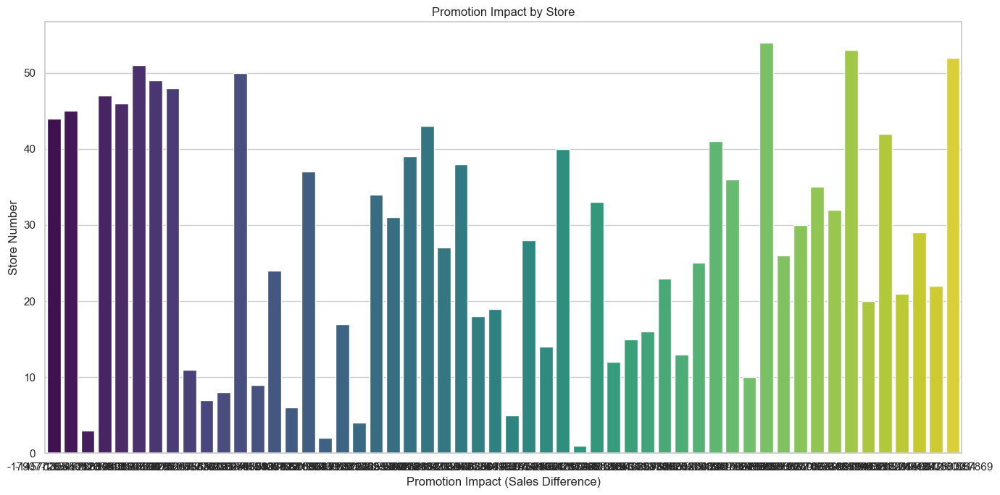

## **STORE SALES FOR OPTIMAL INVENTORY MANAGEMENT USING TIME SERIES FORECASTING**

#### **Project Overview** 📊

This project aims to develop a robust time series regression model to forecast the sales of thousands of products across different stores of Corporation Favorita, a leading grocery retailer based in Ecuador. Accurate sales predictions are critical for ensuring the right quantity of products is always in stock, thereby minimizing stockouts and overstock situations.
Using the CRISP-DM framework, this project involves comprehensive data cleaning, feature engineering, exploratory data analysis, and the application of advanced machine learning models. The training dataset includes historical sales data, store and product information, promotions, transactions, oil prices, and holiday events. By leveraging this rich dataset, the project will address key analytical questions, validate hypotheses, and ultimately build a predictive model to enhance inventory management.
The final model will be evaluated on its ability to accurately predict sales, with the goal of achieving an RMSLE of 0.2 or better. Insights from the analysis will inform strategic decisions in marketing, promotions, and supply chain operations, leading to improved efficiency and customer satisfaction at Corporation Favorita. Comprehensive documentation will ensure transparency and reproducibility of the project.

#### **CRISP-DM Framework for Time Series Regression Analysis**

#### **BUSINESS UNDERSTANDING**

#### Objective:

The primary goal of this project is to create a robust and precise time series forecasting model to predict store sales for a variety of products across Favorita stores. Utilizing historical sales data and relevant supplementary information, the model aims to deliver reliable forecasts to optimize Favorita's inventory management, resource allocation, and marketing strategies. Successful implementation of this model will enhance operational efficiency, improve decision-making, and boost profitability for the retailer. To forecast the demand of products in various locations to ensure that Corporation Favorita always has the right quantity of products in stock.

#### Goals:

Build a series of machine learning models to predict unit sales for thousands of items across different Favorita stores.
I will use the provided data to make accurate sales predictions for better inventory management.

#### **DATA UNDERSTANDING**

#### Datasets:

•	train.csv: Time series data of sales, including store number, product family, and promotions.

•	test.csv: Same structure as train.csv, used for making predictions.

•	transaction.csv: Transaction data for each store.

•	sample_submission.csv: Format for submission.

•	stores.csv: Metadata about stores including city, state, type, and cluster.

•	oil.csv: Daily oil prices.

•	holidays_events.csv: Information about holidays and events.

1. 📥 Data Collection
Data Sources:

SQL Server database (table1, table2, table3)
CSV files from designated zip files
Excel file from OneDrive
1. 📥 Data Collection
Collecting data from various sources:

SQL Server database
CSV files
Excel files from OneDrive
2. 📚 Data Loading
Loading and merging collected data:

Utilizing pyodbc for SQL data
Leveraging pandas for CSV and Excel files
3. 🧐 Data Evaluation (EDA)
Exploring and analyzing data:

Summarization
Duplicate checks
Handling missing values
Visual analysis using SARIMA and ADF tests
4. 🧹 Data Processing and Engineering
Data preprocessing:

Managing missing values
Transforming categorical variables
Potentially creating new features
5. 🧪 Hypothesis Testing
Formulating and testing hypotheses:

Statistical methods with scipy
Chi-Square Test of Independence
t-test
6. 📈 Answering Questions with Visualizations
Visualizing time series insights:

Creating plots and charts
matplotlib and seaborn libraries
7. 🌟 Power BI Deployment
Interactive exploration and sharing:

Interact with the Dashboard here Power BI
Discover Python integration with Power BI here
8. ⚙️ Model Training and Evaluation
Training and assessing machine learning models:

ARIMA, SARIMA, XGBoost Regressor, CatBoost Regressor
Using MAE, RMSE, RMLSE metrics
9. 📊 Model Evaluation
Evaluating and fine-tuning the chosen model:

Generating confusion matrices
10. ⚙️ Advanced Model Improvement
Hyperparameter tuning:

GridSearchCV for selected models
11. 🔮 Future Predictions
Predicting future events or trends:

Business forecasting
Proactive measures based on time-dependent outcomes

#### Data Collection
Data for this project will be collected from 3 different sources, a database, OneDrive and GitHub.

#### Data Description
The training data includes dates, store, and product information, whether that item was being promoted, as well as the sales numbers. Additional files include supplementary information that may be useful in building your models

#### File Descriptions and Data Field Information

##### train.csv

•	The training data, comprising time series of features store_nbr, family, and onpromotion as well as the target sales.

•	store_nbr identifies the store at which the products are sold.

•	family identifies the type of product sold.

•	sales gives the total sales for a product family at a particular store at a given date. Fractional values are possible since products can be sold in fractional units (1.5 kg of cheese, for instance, as opposed to 1 bag of chips).

•	onpromotion gives the total number of items in a product family that were being promoted at a store at a given date.

##### test.csv

•	The test data, having the same features as the training data. You will predict the target sales for the dates in this file.

•	The dates in the test data are for the 15 days after the last date in the training data.

##### transaction.csv

•	Contains date, store_nbr and transaction made on that specific date.

##### sample_submission.csv

•	A sample submission file in the correct format.

##### stores.csv

•	Store metadata, including city,state, type, and cluster.

•	cluster is a grouping of similar stores.

##### oil.csv

•	Daily oil price which includes values during both the train and test data timeframes. (Ecuador is an oil-dependent country and its economic health is highly vulnerable to shocks in oil prices.)

##### holidays_events.csv

•	Holidays and Events, with metadata

•	Additional holidays are days added, a regular calendar holiday, for example, as typically happens around Christmas (making Christmas Eve a holiday).

##### Additional Notes

•	Wages in the public sector are paid every two weeks on the 15th and on the last day of the month. Supermarket sales could be affected by this.

•	A magnitude 7.8 earthquake struck Ecuador on April 16, 2016. People rallied in relief efforts donating water and other first need products which greatly affected supermarket sales for several weeks after the earthquake.

#### Hypothesis

Null Hypothesis (H0): There is no significant impact of promotions on the sales of products.

Alternative Hypothesis (H1): There is a significant impact of promotions on the sales of products.

#### Analytical Questions

1.	Is the train dataset complete (has all the required dates)?

2.	Which dates have the lowest and highest sales for each year (excluding days the store was closed)?

3.	Compare the sales for each month across the years and determine which month of which year had the highest sales.

4.	Did the earthquake impact sales?

5.	Are certain stores or groups of stores selling more products? (Cluster, city, state, type)

6.	Are sales affected by promotions, oil prices, and holidays?

7.	What analysis can we get from the date and its extractable features?

8.	Which product family and stores did the promotions affect?

9.	What is the difference between RMSLE, RMSE, MSE (or why is the MAE greater than all of them?

10.	Does the payment of wages in the public sector on the 15th and last days of the month influence the store sales?

#### **DATA PREPARATION**

Steps:

#### Data Cleaning:

•	Handle missing values.
•	Remove or impute anomalies.

#### Feature Engineering:

•	Extract date features (day, month, year, day of the week, etc.).
•	Aggregate promotion counts.
•	Merge oil prices and holidays data.
•	Encode categorical variables.

#### Exploratory Data Analysis (EDA)

•	Visualize sales trends.
•	Analyze promotions impact.
•	Correlate sales with oil prices and holidays.
•	Cluster analysis of stores.

#### **MODELLING**

#### Model Selection:

•	Evaluate different time series forecasting models (e.g., ARIMA, SARIMA, LSTM, Prophet).

•	Use cross-validation to select the best model.

#### Feature Importance:

•	Identify important features impacting sales.

#### Model Training:

•	Train the selected model on the training data.

#### Model Evaluation:

•	Use RMSLE, RMSE, and MAE as evaluation metrics.

•	Validate model performance on the test set.

#### **EVALUATION**

#### Metrics:

•	Root Mean Squared Logarithmic Error (RMSLE)

•	Root Mean Squared Error (RMSE)

•	Mean Squared Error (MSE)

•	Mean Absolute Error (MAE)

Model Performance:

•	Aim for an RMSLE of 0.2 for excellent performance.

•	Document the performance and insights gained from the model.

#### **DEPLOYMENT**

•	Finalize the best performing model.
•	Create a pipeline for real-time predictions.
•	Integrate the model into the existing inventory management system.

#### Documentation

•	Document every step of the process including data cleaning, EDA, hypothesis validation, model building, and evaluation.
•	Provide clear and detailed visualizations to support the analysis.

#### Answering the Analytical Questions

Is the train dataset complete (has all the required dates)?

The train dataset is mostly complete, covering the entire range from January 1, 2013, to August 15, 2017. However, it is missing data for December 25th in the years 2013, 2014, 2015, and 2016. These missing dates could be due to holidays when no transactions were recorded. If these dates are significant for my analysis, I might need to account for them in the model or consider why they are missing.

2.	Which dates have the lowest and highest sales for each year (excluding days the store was closed)?

3.	Compare the sales for each month across the years and determine which month of which year had the highest sales.

4.	Did the earthquake impact sales?

5.	Are certain stores or groups of stores selling more products? (Cluster, city, state, type)

6.	Are sales affected by promotions, oil prices, and holidays?

7.	What analysis can we get from the date and its extractable features?

8.	Which product family and stores did the promotions affect?

9.	What is the difference between RMSLE, RMSE, MSE (or why is the MAE greater than all of them?

#### Root Mean Squared Logarithmic Error (RMSLE):

Definition: RMSLE is the square root of the mean of the squared logarithmic differences between actual and predicted values.

Usage: Suitable for cases where the target values span several orders of magnitude and when predicting relative differences is more important than absolute differences.

#### Root Mean Squared Error (RMSE):

Definition: RMSE is the square root of the mean of the squared differences between actual and predicted values.
 
Usage: Commonly used for regression tasks. It penalizes larger errors more than smaller ones due to squaring, making it sensitive to outliers.

#### Mean Squared Error (MSE):

Definition: MSE is the mean of the squared differences between actual and predicted values.

Usage: Similar to RMSE but without taking the square root. It's used for measuring the average magnitude of errors and is also sensitive to outliers.
Mean Absolute Error (MAE):

Definition: MAE is the mean of the absolute differences between actual and predicted values.

Usage: Measures the average magnitude of errors without considering their direction. It is less sensitive to outliers compared to RMSE and MSE.

#### Why is MAE Greater Than RMSLE, RMSE, and MSE?

Sensitivity to Outliers:

MAE: Less sensitive to outliers because it takes the absolute difference.

RMSE and MSE: More sensitive to outliers due to squaring the differences. Large errors have a disproportionately high impact on the error metric.

Calculation Basis:

MAE: Directly sums the absolute errors.

MSE and RMSE: Square the errors before summing, which amplifies larger errors.

Logarithmic Scale:

RMSLE: Uses the logarithm of the values, which compresses the range and reduces the impact of large errors and differences.

Summary

• RMSLE is useful when the target values span multiple orders of magnitude and relative differences are important.

• RMSE and MSE are more sensitive to outliers and are commonly used for regression tasks where penalizing larger errors is desired.

• MAE is less sensitive to outliers and provides an average error magnitude. It can be greater than RMSLE, RMSE, and MSE because it doesn't square the errors, which means it directly reflects the absolute average error without amplifying larger errors.

10.	Does the payment of wages in the public sector on the 15th and last days of the month influence the store sales?

#### Power BI Deployment 🌟
I take my analysis to the next level with Power BI's Python scripting tool:

#### Time Series Forecasting Stores Sales Prediction and Analysis Dashboard

#### Overview

This dashboard provides a comprehensive analysis of store sales, helping stakeholders understand key trends and factors affecting sales. It combines various visualizations to offer insights into sales performance across different dimensions such as store type, year, month, and promotional activities.

#### Key Metrics (Top Row)
Product Families: There are 33 different product families analyzed.
Number of Stores: Sales data is aggregated from 54 stores.
Total Sales: The overall sales amount to 1.1 billion.
Total Transactions: The total number of transactions recorded is 4.8 billion.

#### Group of Stores by Sales (Top Left)
This bar chart categorizes stores into different types (A, B, C, D, E) based on their sales performance:
Store Type A: 281 million
Store Type D: 280 million
Store Type C: 136 million
Store Type B: 117 million
Store Type E: 49 million

This visualization helps in identifying the store types contributing most to the sales.

#### Promotion by Sales and Oil Price (Top Center)
This scatter plot examines the relationship between promotions and sales, alongside the oil prices:
Promotions appear to increase sales significantly.
Sales are represented in orange, while oil prices are in blue.
Sales are higher when promotions are run, irrespective of the oil price fluctuations.

#### Holiday Status by Sales (Top Right)
The donut chart shows the sales distribution between holiday and non-holiday periods:
Holiday Sales: 194 million (18%)
Non-Holiday Sales: 90% of the total sales

This indicates that holidays positively impact sales, albeit representing a smaller portion of the total sales period.

#### Total Sales by Year (Bottom Left)
The bar chart displays yearly sales from 2013 to 2017:
2013: 142 million
2014: 213 million
2015: 244 million
2016: 299 million
2017: 198 million

This helps in understanding the growth trend, with a peak in 2016 and a slight decline in 2017.

#### Month and Year by Sales (Bottom Right)
- The line chart shows monthly sales trends over the years, highlighting specific months with high sales:
- Sales peak in June (108 million), December (102 million), and July (101 million).
- February and September typically show lower sales.

This visualization aids in identifying seasonal sales patterns and planning for peak sales periods.

#### Insights
This dashboard provides a clear and concise view of sales performance across different dimensions. It highlights key areas where sales are strong, identifies the impact of promotions and holidays on sales, and reveals seasonal trends. Stakeholders can use these insights for strategic planning, resource allocation, and maximizing sales opportunities.

https://cdn-images-1.medium.com/max/1600/1*Bj02c9CqQv6T_H34cCnJxA.png

Find the Power BI dashboard [here] (https://app.powerbi.com/groups/me/reports/3286f2e8-f845-40a4-b4c8-7102fd73f4ef/ce6c51bf9d35cd567039?experience=power-bi)

#### SETUP
It is recommended to have a Jupyter Noteotebook or any other standard code editor on your local machine.
Install the required packages locally to your computer.

It is recommended that you run a python version above 3.0. You can download the required python version from here.

Use these recommended steps to set up your local machine for this project:

Create the Python's virtual environment :
This will isolate the required libraries of the project to avoid conflicts.
Choose any of the line of code that will work on your local machine.

     python3 -m venv venv
     python -m venv venv
Activate the Python's virtual environment :
This will ensure that the Python kernel & libraries will be those of the created isolated environment.

     - for windows : 
                  venv\Scripts\activate

     - for Linux & MacOS :
                  source venv/bin/activate
Upgrade Pip :
Pip is the installed libraries/packages manager. Upgrading Pip will give an to up-to-date version that will work correctly.

     python -m pip install --upgrade pip
Install the required libraries/packages :
There are libraries and packages that are required for this project. These libraries and packages are listed in the requirements.txt file.
The text file will allow you to import these libraries and packages into the python's scripts and notebooks without any issue.

    python -m pip install -r requirements.txt 

Clone this repository to your local machine.
Install the required Python packages using pip:
pip install -r requirements.txt
You're now ready to dive into this exciting data journey with us!

🤝 #### Contributing
Contributions are welcome! Feel free to open an issue or submit a pull request.

- Fork the repository. 
- Create a new branch: git checkout -b feature-name. 
- Commit your changes: git commit -m 'Add feature'. 
- Push to the branch: git push origin feature-name. 
- Create a pull request.

Author 👨‍💼
Name: Wisdom Edem Drah
Article Link: [here]()
Github: [here](https://github.com/Wisdom-EdemD-rah)

#### Acknowledgments 🙏
I would like to express my gratitude to the [Azubi Africa Data Analyst Program](https://www.azubiafrica.org/data-analytics) for their support and for offering valuable projects as part of this program. Not forgeting my scrum masters on this project Rachel Appiah-Kubi & Glen Nii-Noi Anum.

#### License 📜
This project is licensed under the [MIT License](https://github.com/Wisdom-EdemD-rah/Time-Series-Forecasting-Store-Sales-Prediction/blob/main/LICENSE) - see the LICENSE.md file for details.

📧 #### Contact
For questions or feedback, please contact [Wisdom Edem Drah](https://github.com/Wisdom-EdemD-rah)
Coonect with me on [LinkedIn Here](https://www.linkedin.com/in/wisdom-edem-drah-/)
